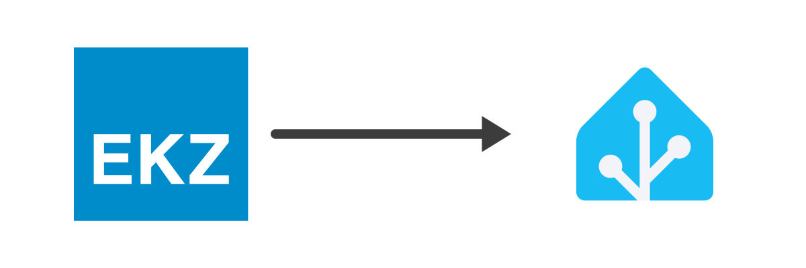

  

# EKZ Smart Meter → Home Assistant

**A way to get your EKZ smart-meter data into Home Assistant.** If you're an [EKZ](https://www.ekz.ch) customer and you use [Home Assistant](https://www.home-assistant.io), this is a HACS custom integration that pulls your electricity consumption (and, optionally, the CHF cost at your tariff) from [myEKZ](https://my.ekz.ch) into HA's **Energy dashboard**, correctly handling EKZ's 1-2 day publication lag.

> **Disclaimer.** I am not affiliated with, employed by, endorsed by, or otherwise connected to EKZ.

## Why this exists

Home Assistant regular sensors can only record "now" values; you can't backfill yesterday's reading by writing a state with a historical timestamp. But the Energy dashboard reads from **long-term statistics**, which the recorder lets you write to directly with any timestamp you want (that's how integrations like [Tauron AMIplus](https://github.com/PiotrMachowski/Home-Assistant-custom-components-Tauron-AMIplus) handle the same problem, discussed on the [HA community forum][forum]).

This integration logs into myEKZ, fetches historical 15-minute consumption, optionally fetches matching 15-minute prices from EKZ's public tariffs API, aggregates everything to hourly buckets (kWh + CHF), and pushes them to HA's long-term statistics via `async_add_external_statistics`. The result: delayed EKZ data shows up on the Energy dashboard with the correct historical timestamps.

[forum]: https://community.home-assistant.io/t/integrating-delayed-energy-consumption-into-the-energy-dashboard/741031

## Credits

Thanks to [ekzexport](https://github.com/mensi/ekzexport) for the myEKZ login and scraping, this integration pulls it in as a pip dependency. Tariff pricing comes from EKZ's public [tariffs API](https://api.tariffs.ekz.ch/swagger/index.html).

## How to install it

Works on every HA flavor (HAOS, Supervised, Container, Core) because it's a pure-Python custom integration loaded by Core.

### 1. On myEKZ

1. Log into [my.ekz.ch](https://my.ekz.ch) and enable **15-minute granular data** under account settings. Without this, EKZ only exposes hourly values, which is too coarse for per-interval cost math.
2. Grab your **installation ID** from the URL bar while logged in (it's the numeric segment in the path).

### 2. In Home Assistant

1. If you don't have [HACS](https://www.hacs.xyz/docs/use/) yet, install it.
2. **HACS → ⋮ (top right) → Custom repositories** → paste `https://github.com/wesjdj/ekz-homeassistant-smart-meter`, set the type to **Integration**, click **Add**. Then find **"EKZ Smart Meter"** in the HACS list, install it, and restart HA.
3. **Settings → Devices & Services → + Add Integration → "EKZ Smart Meter"**, and fill in:
   - **myEKZ username / password**
   - **TOTP secret**: leave blank unless you have 2FA enabled on myEKZ. If you do, set up an authenticator app under your myEKZ security settings, click the "can't scan QR code" link during setup, and paste the revealed base32 string (looks like `AAAA BBBB CCCC DDDD ...`) here. Spaces between groups are fine. This mirrors how [ekzexport](https://github.com/mensi/ekzexport) recommends it.
   - **Installation ID**: the number you grabbed from the myEKZ URL.
   - **Tariffs** _(optional)_: leave empty to skip the CHF cost statistic. To record costs, pick one or more tariff names from the dropdown; see [Tariffs](#tariffs-optional-for-the-chf-cost-statistic) below for how to pick the right one(s).
   - **Time of day to run import** (default `07:00`, HA local time). EKZ publishes once per day with a 1–2 day lag, so daily is plenty.
   - **Jitter window in minutes** (default `30`). The real run fires at a random offset in `[0, jitter]` after the scheduled time, so not every install of this integration hammers EKZ's API at exactly 07:00.
   - **Max days to backfill on first run** (default `3650` ≈ 10 years = "everything EKZ has"; set `0` to auto-detect the earliest date your installation has 15-min data for).

That's it: the first import kicks off in the background as soon as you submit the form. A multi-year backfill can take a couple of minutes. From then on it runs once a day at the configured time (plus jitter). Data shows up under **Developer Tools → Statistics** (search for `ekz:`).

You can trigger a run at any time via **Developer Tools → Services → `ekz.import_now`**. Useful after changing tariff selection, or when you just want to see data land now. All settings (tariffs, schedule, jitter, backfill cap) are editable via the integration's **Configure** button; no need to re-enter credentials.

If you enable a tariff on a system that already has consumption history, the next import re-fetches the whole backfill range so the CHF series is populated retroactively, not just from today forward.

## Tariffs (optional, for the CHF cost statistic)

Pick one or more EKZ tariff names from the multi-select dropdown in the config flow and the importer fetches matching 15-minute prices from EKZ's public [tariffs API](https://api.tariffs.ekz.ch/swagger/index.html), multiplies them by your consumption per interval, and emits an `ekz:energy_cost` CHF statistic alongside the kWh ones.

This works for **every EKZ tariff**, not just dynamic. The API publishes 15-min prices for fixed tariffs too (the same price 96×/day), and peak / off-peak splits inside fixed tariffs are honoured.

### Which tariff name(s) should I pick?

Check your current product on the myEKZ portal. The page heading looks like "Ihr aktuelles Netzprodukt: EKZ Netz **400F**" (or `400ST`, `400WP`, `400D`, `400B`). Then use the matching `integrated_*` entry below, which covers your whole bill (energy + grid + national fees):

| Your EKZ product               | Pick this tariff name |
| ------------------------------ | --------------------- |
| Netz 400ST (standard)          | `integrated_400ST`    |
| Netz 400F (flexibility, HT/NT) | `integrated_400F`     |
| Netz 400WP (heat pump)         | `integrated_400WP`    |
| Netz 400D (dynamic, 2026+)     | `integrated_400D`     |
| Netz 400B (lighting)           | `integrated_400B`     |

**One gotcha**: `integrated_*` bundles _don't_ include the municipal concession fee (Konzessionsabgabe / regional Förderabgabe). If your EKZ invoice has that line item, also add the matching entry from the "Regional" group in the dropdown: `regional_fees_lt500MWh_ZH` for most Zurich-area residential customers under 500 MWh/year, or `regional_fees_Menzingen` / `regional_fees_Einsiedeln` for those specific municipalities. All selected tariffs are summed per 15-min interval.

If you'd rather assemble components à la carte, the dropdown also exposes `electricity_*`, `grid_*`, `national_fees_*`, and `metering_*` building blocks. The full list is in the [Swagger UI](https://api.tariffs.ekz.ch/swagger/index.html); exotic variants (`_E`, `_woSDL`, `_inclFees`, etc.) can be typed as a custom value in the dropdown even if they aren't listed.

Prices returned by the API are VAT-exclusive, so the resulting `ekz:energy_cost` stat is also VAT-exclusive. For a simple fixed tariff, you can also skip all this and use HA's built-in "Use a static price" option on the consumption entity in the Energy dashboard instead.

## What ends up in HA

All statistics are under the `ekz` source, with `has_sum: true`:

| statistic_id                     | Unit | Meaning                                          |
| -------------------------------- | ---- | ------------------------------------------------ |
| `ekz:energy_consumption`         | kWh  | total consumption, cumulative                    |
| `ekz:energy_consumption_peak`    | kWh  | peak-tariff (HT) consumption, cumulative         |
| `ekz:energy_consumption_offpeak` | kWh  | off-peak-tariff (NT) consumption, cumulative     |
| `ekz:energy_cost`                | CHF  | cumulative cost (only when a tariff is selected) |

In **Settings → Dashboards → Energy**:

- Under "Electricity grid → Add consumption", pick `ekz:energy_consumption` and choose "Use an entity tracking the total consumption".
- If you selected a tariff, under the same consumption entry you can set "Use an entity tracking the total costs" → `ekz:energy_cost`.

## How the delayed-data maths works

- HA long-term statistics are hourly buckets keyed by `(statistic_id, start)`.
- Re-importing the same hour overwrites; each entry's `sum` is cumulative since the beginning of the series.
- Before importing, the integration queries HA for the latest hour it already has for each statistic and resumes the cumulative sum from there, so sums stay monotonic across runs.
- For `ekz:energy_cost`, the 15-minute price and the 15-minute consumption are multiplied _before_ aggregating to the hour, so hours with highly variable rates (which is exactly what dynamic tariffs do) get the correct cost total.

## Contributing

Issues and PRs welcome!
